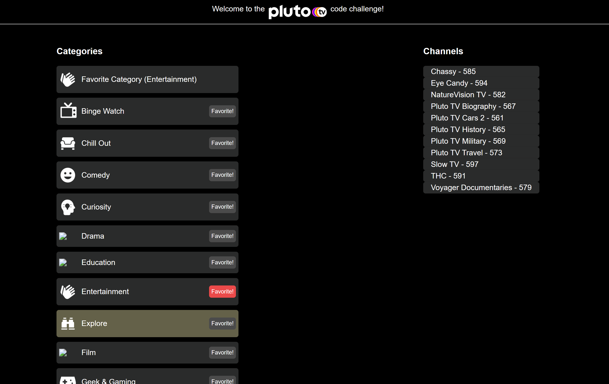

# Pluto TV Interview

Notes from Nathan:

```
Tony G,

Summary:
I left all the code in the original, single files, and just used comments to show
you where I would have broken it into a separate file.

Time:
I'd like to say I completed all this in the allotted 30 minute period that we had on the
call today, but I didn't. It definitely took me longer.
I spent the most time on the 'favorite' feature.

Honesty:
For the App, I did not need to google anything.
For the Generator questions, I wanted to google yield*, but remained "honest", and did not,
which will likely be reflected in the accuracy of my answer lol
```

## The channel app should satisfy all conditions: (src/index.js)

* I just created a create-react-app and moved the source code into this project. The only thing I added was `node-sass` so I could keep using your pre-written styles.
* I implemented the 'favorite' feature for categories
  * If one is favorited, the favorite button appears 'active', and a new category appears at the top of the categories list, hinting at the category.
* Everything is sorted alphabetically
* I changed the css just a tiny bit, so that the images, labels and buttons would line up. I wrote notes in the .scss file marking the changes I made. I used B.E.M. (although I normally used styled-components).
* I made use of `useMemo` like we talked about so you could see what I was suggesting earlier today.
* I curried some utility functions, and partially applied a couple to create specialized functions (I was talking about it but didn't express myself well, so I wanted to show you a concrete example. Normally I'd have ramda)
* I considered breaking out the list management into a custom react hook, like `useFilteredList` or something, but I was worried it would make the code look so complex that it was hard to follow. Especially with it all in one file. So I didn't.

## Generators (generators.js)
I did all of the work right in the provided file. I "explained" myself within the comments.

But I did slightly change the export so that I could just run `node ./generators.js` and execute the code

## Screenshot of the functioning app
